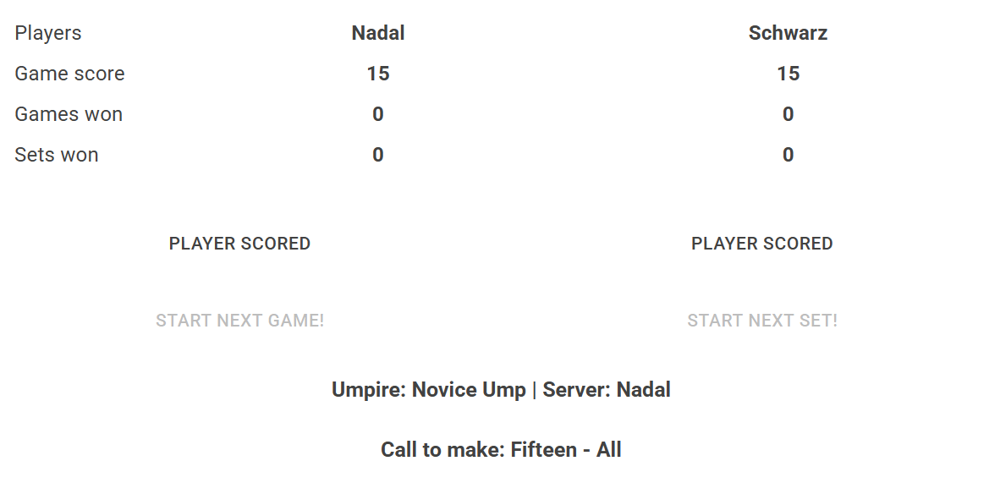

## Pocket Umpire!
So you're taking up umpering tennis games?

Got no clue what you're doing, but wan't to ump som games anyway?

This is the app for you.

Welcome to "Pocket umpire", your all-in-one helper for scoring and keeping track of tennis games.

## How to use it?

Don't worry, it's easy!

### Step 1
Input player names, your name, and number of sets in the match and press "NEW MATCH!"

### Step 2

When player scores, press corresponding button!

### Step 3

Call out the calls on the bottom of the screen loud and clear.
Revel in the crowds cheer as you get the calls right, time and time again!

### Step 4

When you get the opportunity, start new games or sets when the buttons are available.

### Step 5

Repeat!

## Enjoy!

/Your hoarse programmer